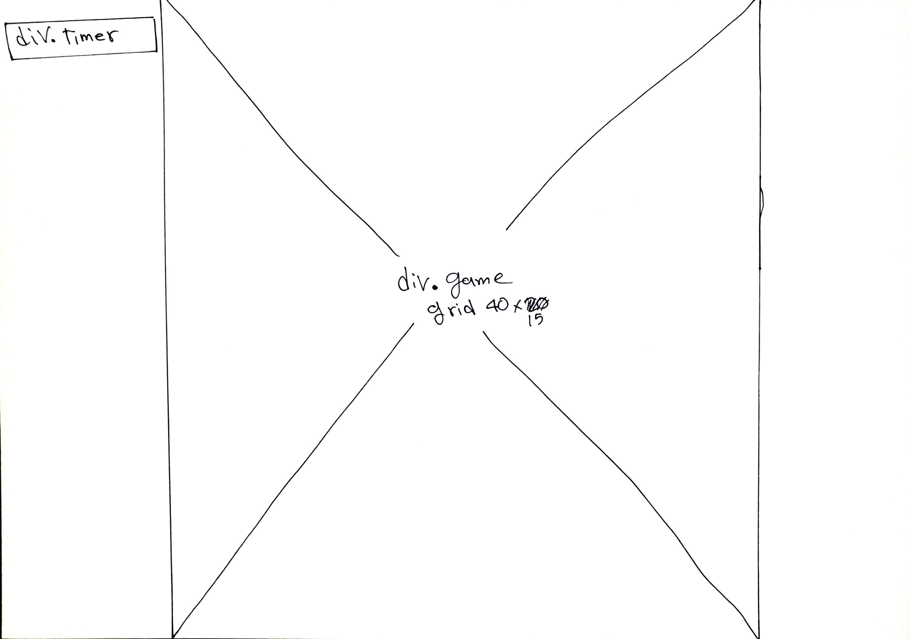

# Frogger

### [link to the game](https://pages.git.generalassemb.ly/alyamaniedrees/Project_Prompt_1/)

## **Libraries Used:**

### **jQuery**
    
Only jQuery library were used to create this project.

## **Approach:**

### **Wireframe:**

Landing screen

Game screen

### **Screenshots:**

Landing screen

Game screen

This project uses **CSS Grid Layout Module** heavily to imitate the the arcade game **Frogger**.
* `createMap` Function creates a 2D matrix with given X and Y values.
* `drawTiles` Function draws the game sprites, background images and colors by appending new `
`s to our grid and adding `css` style to each `
`.
* `findChar` Function search and locate the player inside the 2D matrix each time we want to move the player.
* `spawnCar` and other Functions like it draws the enemies and handle the enemies movements every given time.
* `sound` Function handle the sounds for us.
* Player movements done by adding a `keydown` event listener to `document` and a `switch` Statemen for each key value (`w = 87 a = 65 s = 83 d = 68`).

## Problems:

* Enemies movement not smooth
* Enemies movement choppy sometimes due to the heavy use of `setInterval` function.